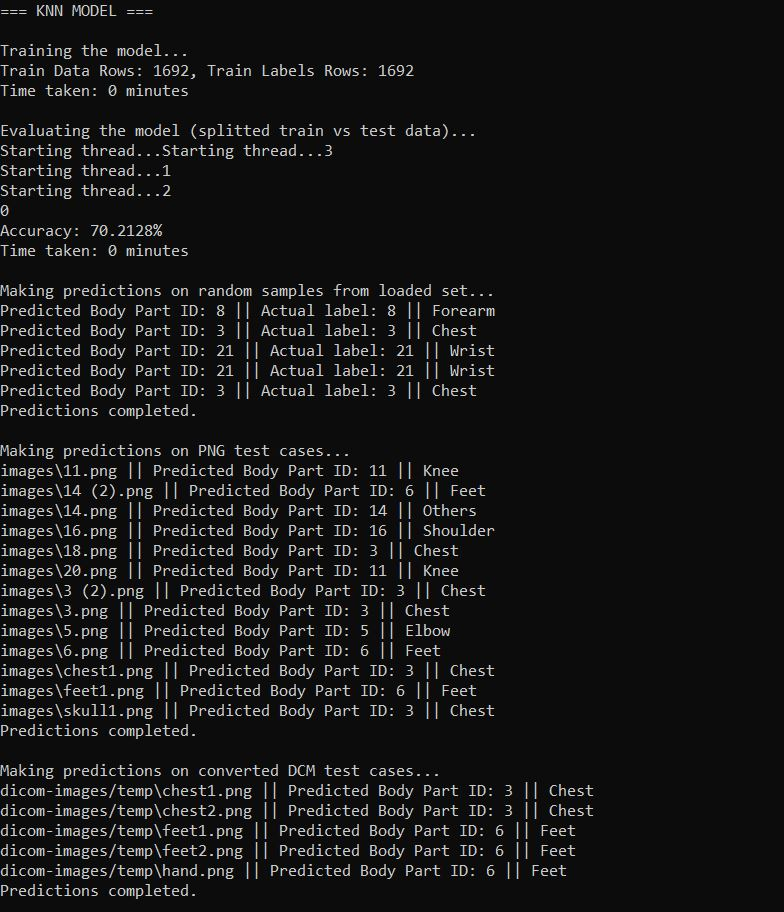

# Body Part Recognition System

This project implements a body part recognition system using machine learning techniques. It processes DICOM images, converts them to PNG format, and utilizes SVM (Support Vector Machine) and KNN (K-Nearest Neighbors) classifiers to identify various body parts from medical images.

This project is based on my other project [TrafficSignRecognition](https://github.com/amWRit/TrafficSignRecogition).
## Features

- **Model Training**: Train classification models using SVM and KNN algorithms.
- **Prediction**: Make predictions on test datasets and evaluate model performance.
- **Data Handling**: Load training and testing data from specified directories.
- **DICOM Image Processing**: Load and preprocess DICOM images for analysis.

## Getting Started

### Prerequisites

- C++ Compiler (e.g., g++)
- CMake
- OpenCV
- DCMTK (for DICOM file handling)

## Demo

### 1. **Loading data**


### 2. **SVM Model**


### 3. **KNN Model**



### Installation

1. Clone the repository:
    - ```git clone https://github.com/amWRit/BodyPartRecognition.git```
    - ```cd BodyPartRecognition```

2. Install the required dependencies (OpenCV, DCMTK).


### Usage

1. Prepare your dataset:
- Place your training data in the `bodyparts-train-data` directory.
- Place your test png images in the `images` directory.
- Place your test dicom images in the `dicom-images` directory.

2. Run the application: ```./BodyPartRecognition```

3. The application will load the data, train the models, and output predictions along with accuracy metrics.


## Models Used

- **SVM (Support Vector Machine)**: A supervised learning model used for classification tasks.
- **KNN (K-Nearest Neighbors)**: A simple, instance-based learning algorithm used for classification.

## Acknowledgments

- [X-ray Body Images Dataset](https://www.kaggle.com/datasets/ibombonato/xray-body-images-in-png-unifesp-competion/data)
- [DCMTK Documentation](https://support.dcmtk.org/docs/index.html)


## License

This project is licensed under the MIT License - see the [LICENSE](LICENSE) file for details.
